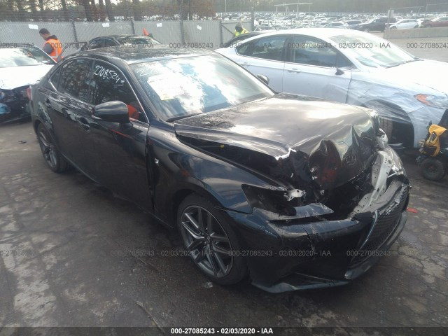
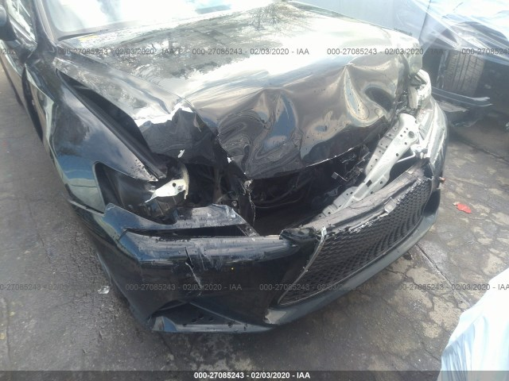
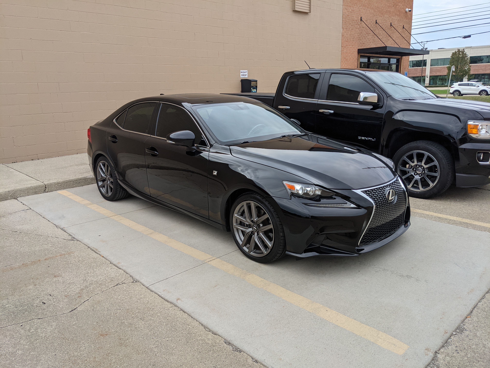

I wanted a project car.  I needed a reliable car.  I was comfortable doing basic maintenance but I wanted more.  A challenge.  There were plenty of YouTube videos of people buying wrecked cars, fixing them, and showing how much money they saved versus buying a car that wasn't in a crash.  It seemed like a good deal.  Buying a wrecked car would give me a project and a good car at a good price.  So I set a goal for myself.  I wanted to buy a totaled car and fix it.

